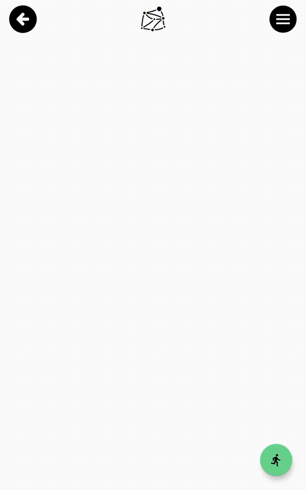

# Mesh App 
Данный репозиторий содержит демонстрацию MVP проекта сети IoT-устройств, связанных посредством технологии Bluetooth Mesh.

Контекст: есть сеть из IoT-устройств, которые измеряют пульс 1 раз в секунду и отправляют данные на главное устройство. Главное устройство находится в постоянном цикле накопления и отправки пульсов на внешнее устройство-клиент. В данном репозитории приведена демонстрация реализации приложения для устройства-клиента.

## Функциональность приложения
С помощью данного приложения можно:
* Следить за показателями пульсов спортсменов в настоящем времени. Все данные сохраняются в локальную базу данных. 
* Просматривать динамику показателей с помощью графика. 
* Изменять порядковые номера для каждого из IoT-устройств и присваивать им осмысленные имена. Изменения порядковых номеров сохраняются локально на устройствах. Имена сохраняются в базу данных приложения и сопоставляются порядковым номерам.

## Использованные технологии 
* Язык программирования: Kotlin
* Архитектурный паттерн: MVVM (Model-View-ViewModel)
* android.bluetooth.le.* для работы с Bluetooth Low Energy
* Room - для локального хранения данных в БД
* Hilt - для внедрения зависимостей
* ViewModel и LiveData для реализации архитектурного паттерна MVVM
* MPAndroidChart - для построения графиков
* Navigation Component для реализации навигации
* Разметка: XML, ConstraintLayout

## Скриншоты и видео
  
 
